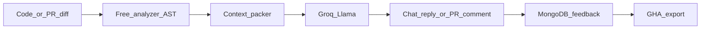

# Beat GPT with Groq + free tools + Actions

Stop competing with ChatGPT on raw model IQ. Use what you already have—Groq, free static analysis, MongoDB data, and GitHub Actions—to build a grounded coding system (analyze → Groq → act) that is more productive than plain GPT chat for both PolyCode learners and your own repo workflow.

## Todos

- [x] Wire analyzer + optional code/language/history into `/chat` via ContextBuilder + pipeline prompt pack
- [x] Add one-shot CLI/script: analyze file → Groq review for local use without frontend
- [x] Add `pr-mentor.yml`: diff + analyzer + Groq → PR comment using `GROQ_API_KEY` secret
- [x] Add pytest CI workflow and fail-triage Groq comment step
- [x] Add small fixture set to measure grounded chat vs blind Groq (prove productivity)

## Honest baseline

ChatGPT wins on model quality. Your free stack wins when the **system** does work GPT chat does not: deterministic code analysis, repo/CI context, structured pedagogy, and automated PR loops. PolyMentor already has pieces of that system—they are just disconnected.

**Default target:** one shared core that powers (1) a stronger learner `/chat` and (2) a free GitHub Actions coding bot. Defer paid GPU LoRA *serving*—training without free hosting does not make you more productive than GPT today.

---

## What you have today (and the gap)

| Asset | Status | Gap / Current State |
| --- | --- | --- |
| Groq chat in [`src/inference/pipeline.py`](src/inference/pipeline.py) | Live Hybrid | **Grounded via automatic static analyzer & AST injection** |
| Analyzer in [`src/analysis/advanced_analyzer.py`](src/analysis/advanced_analyzer.py) | Live Hybrid | **Integrated automatically into `/chat` and pipeline loop** |
| [`ChatRequest`](src/api/app.py) | Full Support | Fully extended with optional `code`, `language`, `history`, `repo_root` |
| Tree-sitter under `vendor/` | Active in `src/` | Integrated into `RepoParser` for multi-language AST extraction |
| GHA daily smoke + Mongo export | Live + Hybrid Smoke | No PR review / fail triage yet |
| LoRA train/eval scripts | Local GPU path | No free serving → not the productivity lever |

---

## Strategy: three free levers that beat “just ask GPT”

### 1. Ground Groq with free analysis (product + CLI)

Make `/chat` a **hybrid mentor**: run `AdvancedCodeAnalyzer` first, inject findings into the Groq system/user prompt, then answer.

Concrete changes:
- Extend `ChatRequest` with optional `code`, `language`, `history`.
- Add a small `ContextBuilder` that packs: level guidance + analyzer errors/suggestions + truncated code + last N turns.
- Keep token budget tight for Groq free tier (e.g. analyzer summary ≤ ~800 chars + code ≤ ~2k tokens).
- Optionally wire tree-sitter parse errors as a second free signal (Python/JS/C++/Java only).

Why this beats GPT chat: GPT guesses; you **prove** bugs with AST/regex before the LLM speaks—faster, cheaper, more trustworthy for learners.

### 2. GitHub Actions coding bot (your own productivity)

Use free `ubuntu-latest` minutes + `GROQ_API_KEY` secret. Two workflows:

**A. PR review** (`on: pull_request`)
- Checkout + `git diff` against base
- Run analyzer on changed `.py`/`.js`/`.java`/`.cpp` files (no GPU)
- Call Groq with: diff + analyzer JSON + “review like a senior mentor; list bugs, risks, test gaps”
- Post as PR comment via `gh` / `github-script`

**B. CI fail triage** (`workflow_run` or reusable step after tests fail)
- Capture pytest/npm log tail
- Groq: root cause + minimal fix sketch
- Comment on the failing PR/commit

This is the biggest “more productive than GPT” unlock on $0: GPT lives in a browser tab; your bot lives **where the code and failures already are**.

### 3. Keep data loop; pause “custom model replaces Groq”

Keep [`mongodb-prompts-pipeline.yml`](.github/workflows/mongodb-prompts-pipeline.yml) exporting liked chats—that is free signal for later.

Do **not** spend cycles on GPU hosting / hybrid routing until you have free Colab/Kaggle experiments that clearly beat Groq on a fixed eval. Serving LoRA costs money; Actions + grounded Groq does not.

---

## Implementation order (smallest → highest leverage)

1. [x] **Hybrid `/chat`** — analyzer → context → Groq; expand request schema; update smoke test payload in [`polymentor-daily.yml`](.github/workflows/polymentor-daily.yml).
2. [x] **CLI one-shot & batch analyzer** — `scripts/analyze_file.py` implemented with automatic language inference, Git repository root discovery, AST structural grounding, machine-readable JSON mode, quality gate exit codes (`--fail-on-bugs`, `--min-score`), and directory batch scanning.

3. [x] **`pr-mentor.yml` & PR review bot** — Automated PR diff review implemented in `scripts/analyze_pr.py` and `.github/workflows/pr-mentor.yml` with multi-file diff hunk parsing, deterministic static analysis bug detection, AST structural grounding, quality scorecards, risk assessment badges, prioritized token budget pruning, and CI artifact archiving.
4. [x] **`pytest.yml` & `triage_pytest_failure.py` CI Triage Bot** — Automated test failure analysis implemented with structured regex diagnostic parsing, critical traceback tail preservation, AST source code grounding via `RepoParser`, diagnosis scorecards, machine-readable JSON outputs, and `pull_request_target` permissions for secure PR commenting and artifact archiving.

5. **Tree-sitter polish** — only after hybrid chat works; replace weakest regex paths.

Out of scope for this budget plan: OpenAI, paid RunPod serving, FAISS/CodeBERT revival, rewriting the vision doc’s Phase-4 “replace Groq” fantasy as the near-term goal.

---

## Success metrics (prove it vs GPT)

- Learner chat with pasted code: analyzer findings appear in reply **and** match real issues ≥80% of the time on a 20-snippet fixture.
- PR bot: first useful comment within Actions runtime; no Groq call if diff empty.
- Your workflow: time from “tests failed” → “actionable fix sketch in PR” without opening ChatGPT.
- Cost: Groq free tier + Actions only; zero new paid APIs.

---

## Key files to touch

- [`src/api/app.py`](src/api/app.py) — richer `ChatRequest`, hybrid route
- [`src/inference/pipeline.py`](src/inference/pipeline.py) — accept analysis context in prompt pack
- New: `src/inference/context_builder.py` — free context packing
- [`src/analysis/advanced_analyzer.py`](src/analysis/advanced_analyzer.py) — reuse as-is first
- New: `.github/workflows/pr-mentor.yml`
- Later: `.github/workflows/ci-tests.yml` + triage step
- [`.env.example`](.env.example) — document `GROQ_API_KEY` for Actions secrets only (no new paid keys)
